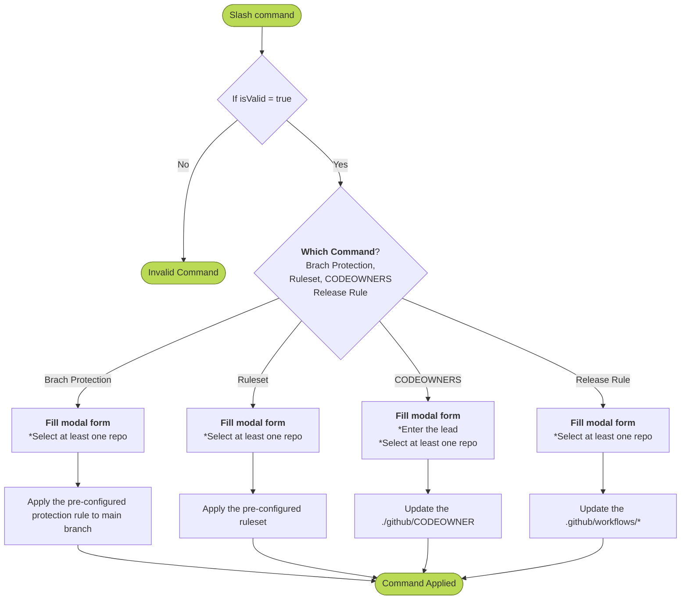

# Octobot

## Flowchart

```mermaid
flowchart TD
  A --> B
  B --> |No| C
  B --> |Yes| D
  D --> |Brach Protection| E
  D --> |Ruleset| F
  D --> |CODEOWNERS| G
  D --> |Release Rule| H
  E --> I
  F --> J
  G --> K
  H --> L
  I --> Z
  J --> Z
  K --> Z
  L --> Z

  A([Slash command]):::T
  B{If isValid = true}
  C([Invalid Command]):::T
  D{"`**Which Command**?
  Brach Protection,
  Ruleset, CODEOWNERS
  Release Rule`"}
  E["`**Fill modal form**
  *Select at least one repo
  `"]
  F["`**Fill modal form**
  *Select at least one repo
  `"]
  G["`**Fill modal form**
  *Enter the lead
  *Select at least one repo
  `"]
  H["`**Fill modal form**
  *Select at least one repo
  `"]
  I["`Apply the pre-configured protection rule to main branch`"]
  J["`Apply the pre-configured ruleset`"]
  K["`Update the ./github/CODEOWNER`"]
  L["`Update the .github/workflows/*`"]
  Z([Command Applied]):::T
  classDef T fill:#bada55, stroke:#6f8233
```
